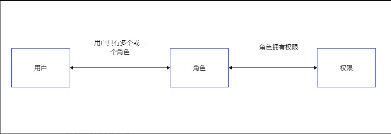
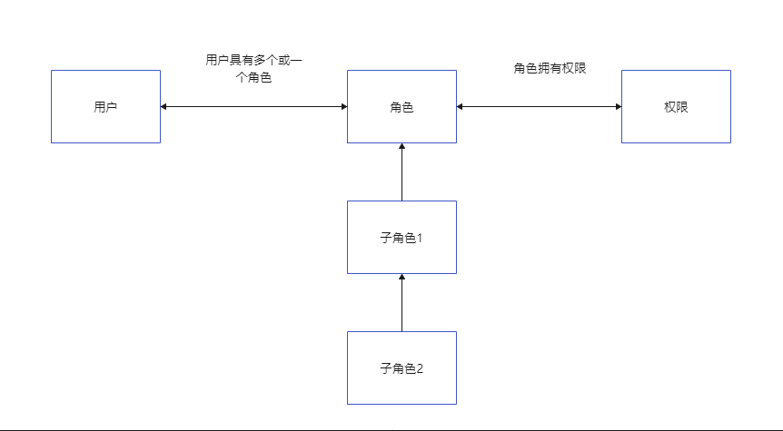
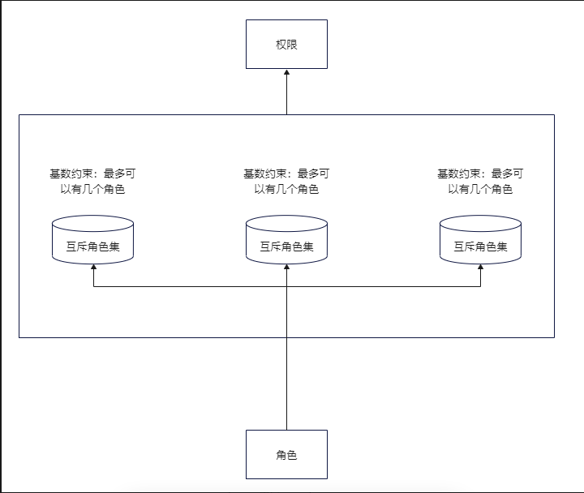

# 一. 什么是 RBAC

RBAC（Role-Based Access Control）即基于角色的权限控制。通过角色关联用户，角色关联权限的方式赋予用户权限。
RBAC 的核心是角色。在 Demo 项目中的权限控制是直接给用户分配权限的，这样少了角色这一层关系，扩展性弱，适合一些用户数量少并且角色类型少的平台。
批量的用户权限修改可以通过修改角色权限来做到。

# 二. RBAC 模型的分类

RBAC 模型一共分为了四种，分别是 RBAC0、RBAC1、RBAC2、RBAC3，RBAC0 是所有的基础，是最简单的逻辑，1-2-3 都是对 RBAC0 的升级。

## 2.1 RBAC0 模型

RBAC0 模型是最基础的模型，是所有升级版的基础逻辑，这里面包含了俩种情况：

    ○ 用户和角色多对一。一个用户可以充当一个角色，一个角色可以由多个用户担任。
    ○ 用户和角色多对多。一个用户可以充当多个角色，一个角色可以由多个用户担任。

通常在简单的系统中，也就是人员较少，岗位分工明确的场景下，尽量使用多对一的权限体系。其他情况可以使用多对多的权限体系，来保证系统的可扩张性。

## 2.2 RBAC1 模型

相对于 RBAC0 模型，RBAC1 新增了继承权限 的概念，也就是子角色，即子角色可以继承父角色的所有权限。

相对于 RBAC0 的优势在哪里呢？例如上下级关系，一个部门有经理、主管、专员，他们的权限都是层级递减的，如果采用 RBAC0 模型，那么需要新增或者删减权限的时候就需要给每个角色分别增加或者删除，如果出现失误，就会造成主管拥有经理没有的权限，也就是越位情况。
如果采用 RBAC1 模型，我们可以定义经理的所有权限，然后主管的权限是在经理的权限基础上做删减，这样就可以避免出现越位的失误情况。

## 2.3 RBAC2 模型

基于 RBAC0 模型，增加了对角色的一些限制：角色互斥、基数约束、先决条件角色等。

    ○ 角色互斥：同一用户不能分配到一组互斥角色集合中的多个角色，互斥角色是指权限互相制约的两个角色。案例：财务系统中一个用户不能同时被指派给会计角色和审计员角色。
    ○ 基数约束：一个角色被分配的用户数量受限，它指的是有多少用户能拥有这个角色。例如：一个角色专门为公司CEO创建的，那这个角色的数量是有限的。
    ○ 先决条件角色：指要想获得较高的权限，要首先拥有低一级的权限。例如：先有副总经理权限，才能有总经理权限。
    ○ 运行时互斥：例如，允许一个用户具有两个角色的成员资格，但在运行中不可同时激活这两个角色。

## 2.4 RBAC3 模型

RBAC3 模型也称为统一模型，也就是 RBAC1 和 RBAC2 的结合模型，包含了 RBAC1 和 RBAC2 的模型特性。
